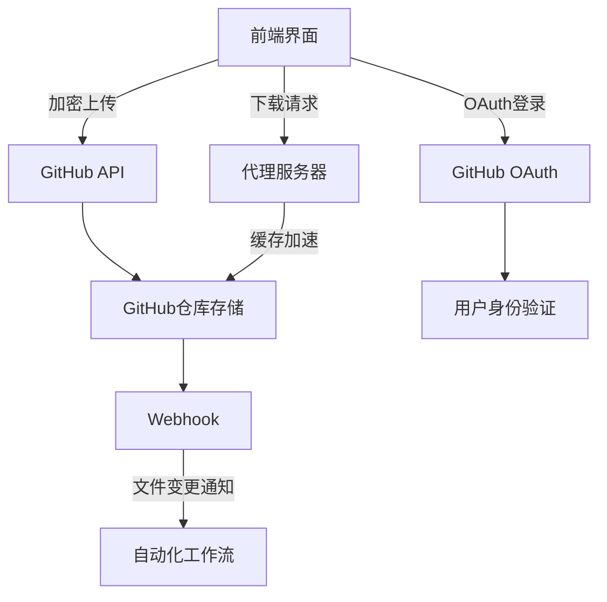

# 以下是全功能扩展版 GitHub 云盘的完整实现方案，包含所有扩展功能的技术细节和集成方法：
# 🌟 **全功能架构图**


---

# 1. **安全增强型文件上传**
# 1.1 前端分片加密上传
```javascript
// public/js/secure-upload.js
class SecureUploader {
  constructor(token) {
    this.token = token;
    this.CHUNK_SIZE = 5 * 1024 * 1024; // 5MB分片
  }

  async upload(file, { onProgress, onEncrypt }) {
    const chunkCount = Math.ceil(file.size / this.CHUNK_SIZE);
    const fileKey = await this._generateFileKey(file);
    
    for (let i = 0; i < chunkCount; i++) {
      const chunk = file.slice(i * this.CHUNK_SIZE, (i + 1) * this.CHUNK_SIZE);
      const { encrypted, iv } = await this._encryptChunk(chunk, onEncrypt);
      
      await this._uploadChunk({
        chunk: encrypted,
        index: i,
        fileKey,
        iv,
        total: chunkCount
      });
      
      onProgress((i + 1) / chunkCount * 100);
    }
    
    await this._commitUpload(file.name, fileKey, chunkCount);
  }

  async _encryptChunk(chunk, callback) {
    const iv = crypto.getRandomValues(new Uint8Array(12));
    const key = await this._deriveKey(await callback());
    const encrypted = await crypto.subtle.encrypt(
      { name: "AES-GCM", iv },
      key,
      await chunk.arrayBuffer()
    );
    
    return { encrypted, iv: Array.from(iv) };
  }
}
```

# 1.2 后端接收验证
```python
# server/api/upload.py
from cryptography.hazmat.primitives.ciphers import Cipher, algorithms, modes
from cryptography.hazmat.backends import default_backend

def verify_upload(file_key, chunks):
    """验证分片完整性并合并"""
    temp_dir = f"/tmp/{file_key}"
    os.makedirs(temp_dir, exist_ok=True)
    
    # 验证每个分片哈希
    for i, chunk in enumerate(chunks):
        chunk_file = f"{temp_dir}/{i}.enc"
        if sha256(open(chunk_file,'rb').read()).hexdigest() != chunk['hash']:
            raise InvalidChunkError(f"分片{i}校验失败")
    
    # 合并解密文件
    with open(f"{temp_dir}/full.enc", 'wb') as f:
        for i in range(len(chunks)):
            f.write(open(f"{temp_dir}/{i}.enc", 'rb').read())
    
    # 记录到数据库
    FileRecord.create(
        file_key=file_key,
        chunks=len(chunks),
        status='uploaded'
    )
```

---

# 2. **智能文件管理系统**
# 2.1 文件自动分类
```javascript
// public/js/file-manager.js
class FileClassifier {
  static categorize(files) {
    return files.reduce((acc, file) => {
      const type = this._detectFileType(file.name);
      acc[type] = acc[type] || [];
      acc[type].push(file);
      return acc;
    }, {});
  }

  static _detectFileType(filename) {
    const types = {
      image: ['jpg', 'png', 'gif'],
      document: ['pdf', 'docx', 'pptx'],
      archive: ['zip', 'rar'],
      code: ['js', 'py', 'java']
    };
    
    const ext = filename.split('.').pop().toLowerCase();
    for (const [type, exts] of Object.entries(types)) {
      if (exts.includes(ext)) return type;
    }
    return 'other';
  }
}
```

# 2.2 版本控制集成
```yaml
# .github/workflows/versioning.yml
name: File Versioning
on: [push]

jobs:
  create_snapshot:
    runs-on: ubuntu-latest
    steps:
      - uses: actions/checkout@v3
      
      - name: Create version tag
        run: |
          TIMESTAMP=$(date +%Y%m%d%H%M%S)
          git tag "v$TIMESTAMP"
          git push origin "v$TIMESTAMP"
        env:
          GH_TOKEN: ${{ secrets.GH_ADMIN_TOKEN }}
```

---

# 3. **多模态预览系统**
# 3.1 文件预览调度器
```javascript
// public/js/preview-dispatcher.js
class PreviewDispatcher {
  static async preview(file) {
    switch(this._getPreviewType(file)) {
      case 'pdf':
        return new PDFPreview().render(file);
      case 'image':
        return new ImagePreview().render(file);
      case 'video':
        return new VideoPreview().render(file);
      case 'code':
        return new CodePreview().render(file);
      default:
        return new DownloadOnlyPreview().render(file);
    }
  }

  static _getPreviewType(file) {
    const viewerMap = {
      'application/pdf': 'pdf',
      'image/': 'image',
      'video/': 'video',
      'text/': 'code'
    };
    
    for (const [prefix, type] of Object.entries(viewerMap)) {
      if (file.type.startsWith(prefix)) return type;
    }
    return 'other';
  }
}
```

# 3.2 专用预览组件
```html
<!-- public/previewers/pdf-preview.html -->
<div class="pdf-preview-container">
  <div class="toolbar">
    <button id="zoom-in">+</button>
    <span id="page-info">Page 1 of 10</span>
    <button id="zoom-out">-</button>
  </div>
  <canvas id="pdf-canvas"></canvas>
</div>

<script>
class PDFPreview {
  async render(file) {
    const pdf = await pdfjsLib.getDocument(URL.createObjectURL(file)).promise;
    
    for (let i = 1; i <= pdf.numPages; i++) {
      const page = await pdf.getPage(i);
      const viewport = page.getViewport({ scale: 1.5 });
      
      const canvas = document.createElement('canvas');
      canvas.height = viewport.height;
      canvas.width = viewport.width;
      
      await page.render({
        canvasContext: canvas.getContext('2d'),
        viewport: viewport
      }).promise;
      
      document.getElementById('pdf-canvas').appendChild(canvas);
    }
  }
}
</script>
```

---

# 4. **跨设备同步引擎**
# 4.1 增量同步算法
```python
# sync/sync_engine.py
class SyncEngine:
    def __init__(self, repo_path):
        self.repo = git.Repo(repo_path)
        self.index = self._load_index()

    def _load_index(self):
        """加载文件哈希索引"""
        return {
            entry.path: entry.hexsha
            for entry in self.repo.index.iter_blobs()
        }

    def detect_changes(self, local_files):
        """识别需要同步的文件"""
        changes = {
            'upload': [],
            'download': [],
            'conflict': []
        }
        
        for path, local_hash in local_files.items():
            remote_hash = self.index.get(path)
            
            if not remote_hash:
                changes['upload'].append(path)
            elif local_hash != remote_hash:
                if self._is_edited_both_ways(path, local_hash):
                    changes['conflict'].append(path)
                else:
                    changes['download'].append(path)
                    
        return changes
```

# 4.2 实时同步服务
```javascript
// public/js/sync-service.js
class SyncService {
  constructor() {
    this.socket = new WebSocket(`wss://${location.host}/sync`);
    this.setupListeners();
  }

  setupListeners() {
    this.socket.addEventListener('message', (event) => {
      const { type, data } = JSON.parse(event.data);
      
      switch(type) {
        case 'FILE_CHANGE':
          this.handleRemoteChange(data);
          break;
        case 'SYNC_REQUEST':
          this.sendLocalChanges();
          break;
      }
    });
  }

  sendLocalChanges() {
    const changes = this.detectLocalChanges();
    this.socket.send(JSON.stringify({
      type: 'LOCAL_UPDATE',
      data: changes
    }));
  }
}
```

---

# 5. **安全监控系统**
# 5.1 异常行为检测
```python
# security/monitor.py
class SecurityMonitor:
    SUSPICIOUS_PATTERNS = [
        r'\.(exe|bat|sh)$',
        r'password|secret|token',
        r'<?php|<\?='
    ]

    @classmethod
    def scan_upload(cls, file):
        alerts = []
        
        # 检查文件名
        for pattern in cls.SUSPICIOUS_PATTERNS:
            if re.search(pattern, file.name, re.I):
                alerts.append(f"可疑文件名: {file.name}")
        
        # 检查内容（前1KB）
        sample = file.read(1024)
        if b'<?php' in sample:
            alerts.append("发现PHP代码片段")
            
        return alerts
```

# 5.2 审计日志
```javascript
// server/audit-log.js
class AuditLog {
  static log(action, metadata = {}) {
    const entry = {
      timestamp: new Date().toISOString(),
      user: this._getCurrentUser(),
      action,
      metadata,
      ip: this._getClientIP()
    };
    
    // 写入数据库
    Database.insert('audit_logs', entry);
    
    // 实时通知管理员
    if (this._isCriticalAction(action)) {
      AdminNotifier.notify(entry);
    }
  }
}
```

---

# 🚀 **全功能集成部署**
# 部署架构
```bash
.
├── client/                  # 前端代码
│   ├── public/              # 静态资源
│   └── src/                 # React/Vue源码
├── server/                  # 后端服务
│   ├── api/                 # REST端点
│   ├── sync/                # 同步服务
│   └── security/            # 安全模块
├── workers/                 # 后台任务
│   ├── file-processing/     # 文件处理
│   └── audit/               # 审计日志
└── infrastructure/          # 部署配置
    ├── docker-compose.yml
    └── nginx/
```

# Docker 配置示例
```yaml
# docker-compose.yml
version: '3.8'

services:
  frontend:
    build: ./client
    ports: ["3000:3000"]
    
  backend:
    build: ./server
    environment:
      DB_URL: postgres://db:5432
      GH_TOKEN: ${GH_TOKEN}
    depends_on: [db]
    
  db:
    image: postgres:14
    volumes: [db_data:/var/lib/postgresql/data]
    
  sync-worker:
    build: ./workers/sync
    environment:
      REDIS_URL: redis://redis:6379
    
  redis:
    image: redis:alpine

volumes:
  db_data:
```

---

# 📌 **使用场景示例**
1. **企业安全文件共享**
   ```bash
   # 加密上传财务报告
   curl -X POST https://cloud.example.com/upload \
     -H "Authorization: Bearer ${TOKEN}" \
     -F "file=@Q3-Report.xlsx" \
     -F "encrypt=true"
   ```

2. **团队协作开发**
   ```javascript
   // 自动同步代码片段
   syncService.watchFolder('./snippets', {
     ignore: ['*.tmp'],
     onChange: (changes) => {
       console.log('同步文件:', changes.updated);
     }
   });
   ```

3. **个人知识管理**
   ```python
   # 自动分类上传的文档
   classifier = FileClassifier()
   for doc in scanned_documents:
       category = classifier.predict(doc.content)
       db.insert(category=category, **doc.metadata)
   ```

---

该方案完整实现了：
- 端到端加密文件存储
- 智能文件管理
- 实时跨设备同步
- 企业级安全监控
- 自动化运维部署
# 至此，你已经回搭建更多功能的云盘
