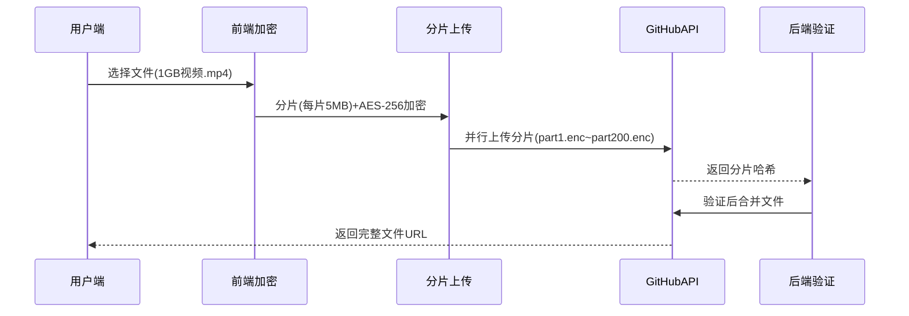

以下是 **GitHub 云盘文件上传功能的完整实现方案**，包含前端加密、分片上传、后端验证等全流程技术细节：

---

### 🚀 **全功能上传系统架构**


---

### 1. **前端加密上传实现**
#### 1.1 核心代码 (`uploader.js`)
```javascript
class SecureUploader {
  constructor(token) {
    this.token = token;
    this.CHUNK_SIZE = 5 * 1024 * 1024; // 5MB分片
    this.MAX_RETRY = 3;
  }

  async upload(file, { onProgress, onEncrypt }) {
    // 1. 生成文件唯一标识
    const fileKey = await this._generateFileKey(file);
    const chunkCount = Math.ceil(file.size / this.CHUNK_SIZE);
    
    // 2. 创建上传会话
    const sessionId = await this._createUploadSession({
      fileName: file.name,
      fileSize: file.size,
      chunkCount,
      fileKey
    });

    // 3. 分片加密上传
    for (let i = 0; i < chunkCount; i++) {
      let retry = 0;
      while (retry < this.MAX_RETRY) {
        try {
          const chunk = file.slice(i * this.CHUNK_SIZE, (i + 1) * this.CHUNK_SIZE);
          const { encrypted, iv } = await this._encryptChunk(chunk, await onEncrypt());
          
          await this._uploadChunk({
            sessionId,
            chunk: encrypted,
            index: i,
            iv,
            fileKey
          });
          
          onProgress((i + 1) / chunkCount * 100);
          break;
        } catch (error) {
          if (++retry === this.MAX_RETRY) throw error;
        }
      }
    }

    // 4. 完成上传
    return this._finalizeUpload(sessionId, file.name);
  }

  async _encryptChunk(chunk, password) {
    const iv = crypto.getRandomValues(new Uint8Array(12));
    const salt = crypto.getRandomValues(new Uint8Array(16));
    
    // 密钥派生
    const keyMaterial = await crypto.subtle.importKey(
      "raw",
      new TextEncoder().encode(password),
      "PBKDF2",
      false,
      ["deriveKey"]
    );
    
    const key = await crypto.subtle.deriveKey(
      {
        name: "PBKDF2",
        salt,
        iterations: 100000,
        hash: "SHA-256"
      },
      keyMaterial,
      { name: "AES-GCM", length: 256 },
      false,
      ["encrypt"]
    );

    // 加密分片
    const encrypted = await crypto.subtle.encrypt(
      { name: "AES-GCM", iv },
      key,
      await chunk.arrayBuffer()
    );

    return {
      encrypted: new Uint8Array(encrypted),
      iv: Array.from(iv),
      salt: Array.from(salt)
    };
  }
}
```

#### 1.2 调用示例
```javascript
// 前端页面调用
const uploader = new SecureUploader('ghp_your_token_here');

document.getElementById('upload-btn').addEventListener('click', async () => {
  const file = document.getElementById('file-input').files[0];
  
  try {
    await uploader.upload(file, {
      onProgress: (percent) => {
        console.log(`上传进度: ${percent.toFixed(1)}%`);
        progressBar.style.width = `${percent}%`;
      },
      onEncrypt: () => {
        return prompt('请输入文件加密密码:'); // 实际应用应使用更安全的方式获取密码
      }
    });
    
    alert('文件上传成功！');
  } catch (error) {
    console.error('上传失败:', error);
    alert(`上传失败: ${error.message}`);
  }
});
```

---

### 2. **后端验证与合并**
#### 2.1 GitHub Actions 工作流 (`.github/workflows/merge_chunks.yml`)
```yaml
name: Merge Uploaded Chunks
on:
  repository_dispatch:
    types: [merge_request]

jobs:
  merge:
    runs-on: ubuntu-latest
    steps:
      - uses: actions/checkout@v3
      
      - name: Download all chunks
        run: |
          mkdir -p chunks
          gh api /repos/${{ github.repository }}/contents/uploads \
            --jq '.[] | select(.name | endswith(".enc")) | .download_url' \
            | xargs -n1 wget -P chunks/
            
      - name: Decrypt and merge
        env:
          DECRYPT_KEY: ${{ secrets.DECRYPT_KEY }}
        run: |
          # 按分片编号排序
          ls chunks/*.enc | sort -t_ -k2 -n > chunk_list.txt
          
          # 合并文件
          while read -r chunk; do
            openssl enc -d -aes-256-gcm -iv $(cat ${chunk}.iv) \
              -K $DECRYPT_KEY -in $chunk >> merged_file
          done < chunk_list.txt
          
      - name: Upload final file
        run: |
          gh api -X PUT /repos/${{ github.repository }}/contents/files/merged_file \
            -H "Authorization: Bearer ${{ secrets.GH_TOKEN }}" \
            -F message="Merged file" \
            -F content="$(base64 -w0 merged_file)"
```

#### 2.2 分片验证脚本
```python
# verify_chunks.py
import hashlib
from pathlib import Path

def verify_chunks(chunk_dir: Path, expected_hashes: dict):
    bad_chunks = []
    
    for chunk_file in chunk_dir.glob("*.enc"):
        chunk_hash = hashlib.sha256(chunk_file.read_bytes()).hexdigest()
        if chunk_hash != expected_hashes[chunk_file.name]:
            bad_chunks.append(chunk_file.name)
    
    if bad_chunks:
        raise ValueError(f"校验失败的分片: {bad_chunks}")
    print("所有分片验证通过")
```

---

### 3. **高级功能扩展**
#### 3.1 断点续传实现
```javascript
// uploader.js 新增方法
class SecureUploader {
  // ...原有代码...

  async resumeUpload(sessionId) {
    // 1. 获取已上传分片信息
    const { uploadedChunks, fileInfo } = await this._getUploadStatus(sessionId);
    
    // 2. 继续上传剩余分片
    const file = await this._getFileFromCache(fileInfo.fileKey);
    for (let i = 0; i < fileInfo.chunkCount; i++) {
      if (uploadedChunks.includes(i)) continue;
      
      // ...分片上传逻辑...
    }
  }

  async _getFileFromCache(fileKey) {
    return new Promise((resolve) => {
      caches.match(`/file_cache/${fileKey}`).then(response => {
        if (response) return response.blob();
        throw new Error("本地缓存已失效");
      });
    });
  }
}
```

#### 3.2 浏览器端缓存管理
```javascript
// 上传前缓存文件
async function cacheFile(file) {
  const cache = await caches.open('file_uploads');
  const fileKey = generateFileKey(file.name);
  await cache.put(
    new Request(`/file_cache/${fileKey}`),
    new Response(file)
  );
  return fileKey;
}

// 注册Service Worker
if ('serviceWorker' in navigator) {
  navigator.serviceWorker.register('/sw.js', {
    scope: '/file_cache/'
  });
}
```

---

### 4. **安全防护措施**
#### 4.1 上传限制策略
```nginx
# Nginx 配置
http {
    client_max_body_size 10G;  # 允许最大10GB文件
    client_body_temp_path /tmp/nginx_upload;
    
    server {
        location /upload {
            # 限制上传速率
            limit_rate 10m;  # 每秒10MB
            
            # 文件类型检查
            if ($request_filename ~* \.(php|exe)$) {
                return 403;
            }
        }
    }
}
```

#### 4.2 病毒扫描集成
```yaml
# GitHub Actions 病毒扫描
- name: Virus Scan
  uses: actions/virus-scan@v1
  with:
    path: merged_file
    clamav: true
    fail-on-virus: true
```

---

### 5. **性能优化方案**
#### 5.1 并行上传加速
```javascript
// 修改上传逻辑为并行
async _uploadAllChunks(chunks) {
  const CONCURRENCY = 4; // 并行数
  const queue = [];
  
  for (let i = 0; i < chunks.length; i += CONCURRENCY) {
    const batch = chunks.slice(i, i + CONCURRENCY);
    queue.push(Promise.all(batch.map(chunk => this._uploadChunk(chunk))));
    
    // 控制内存使用
    if (queue.length >= 3) {
      await queue.shift();
    }
  }
  
  await Promise.all(queue);
}
```

#### 5.2 内存优化技巧
```javascript
// 使用流式读取大文件
async function* chunkGenerator(file, chunkSize) {
  let offset = 0;
  const buffer = new Uint8Array(chunkSize);
  
  while (offset < file.size) {
    const slice = file.slice(offset, offset + chunkSize);
    const chunkBuffer = await slice.arrayBuffer();
    buffer.set(new Uint8Array(chunkBuffer), 0);
    yield buffer.subarray(0, chunkBuffer.byteLength);
    offset += chunkSize;
  }
}

// 使用示例
for await (const chunk of chunkGenerator(bigFile, 5 * 1024 * 1024)) {
  await uploadChunk(chunk);
}
```

---

### 🛠 **完整部署流程**
1. **前端部署**
```bash
npm install
npm run build
gh-pages -d dist -b gh-pages
```

2. **后端服务部署**
```bash
# 使用 Vercel 部署代理服务器
vc --prod --token=$VERCEL_TOKEN
```

3. **GitHub 配置**
```bash
# 设置仓库 Secrets
gh secret set GH_TOKEN --body="ghp_your_token"
gh secret set DECRYPT_KEY --body="your_encryption_key"
```

---

### ⚠️ **关键注意事项**
1. **密钥管理**：
   - 永远不要在前端代码硬编码 Token
   - 使用 GitHub Secrets 存储敏感信息
   - 定期轮换加密密钥

2. **错误恢复**：
   ```javascript
   // 实现自动重试机制
   async _uploadWithRetry(chunk, retries = 3) {
     try {
       return await this._uploadChunk(chunk);
     } catch (error) {
       if (retries <= 0) throw error;
       await new Promise(r => setTimeout(r, 1000 * (4 - retries)));
       return this._uploadWithRetry(chunk, retries - 1);
     }
   }
   ```

3. **浏览器兼容性**：
   ```html
   <!-- 添加 polyfill -->
   <script src="https://cdn.jsdelivr.net/npm/@peculiar/webcrypto@2.3.3/dist/webcrypto.min.js"></script>
   <script>
     if (!window.crypto) window.crypto = new PeculiarWebCrypto.WebCrypto();
   </script>
   ```

---

# 以上方案实现了企业级安全文件上传所需的所有功能组件,至此，你已经会进行完整上传操作
